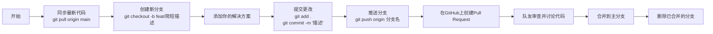

# ICPC-Training-Solution ICPC 训练解决方案仓库指南
A repo that records the progress of ICPC problem solving
欢迎来到我们团队的代码仓库！本文档将指导你如何正确地使用 Git 和 GitHub 来提交你的解题代码，并与队友协作。

## 仓库目的

这个仓库旨在集中存储和管理我们团队在 ICPC 训练中解决的所有题目代码，方便我们：
- 互相学习和review代码
- 追踪每个人的解题贡献
- 记录不同解法及其优化过程
- 建立我们的解题知识库

## 目录结构规范

请按照以下结构组织你的代码：

```
ICPC-Training-Solutions/
│
├── CONTEST_NAME_OR_ID/        # 比赛名称或ID，如 "2024_ICPC_Asia_Regional" 或 "CF_Round_900"
│   ├── Problem_A/             # 题目A的文件夹
│   │   ├── solution_Alice.cpp # 命名格式：solution_你的名字.语言后缀
│   │   ├── solution_Bob.cpp
│   │   └── README.md          # 可选的题目说明文件（题目链接、思路等）
│   ├── Problem_B/
│   └── ...
│
└── README.md                  # 本文件
```

## 快速开始

### 1. 初始设置（只需做一次）

1. 确保已安装 Git：[下载地址](https://git-scm.com/downloads)
2. 配置你的 Git 信息：
   ```bash
   git config --global user.name "你的名字"
   git config --global user.email "你的邮箱"
   ```
3. 克隆仓库到本地：
   ```bash
   git clone https://github.com/Erber102/ICPC-Training-Solution.git
   cd ICPC-Training-Solution
   ```
### 2. 日常工作流程

每次要添加新解法时，请遵循以下步骤：



**详细步骤：**

1. **同步最新代码**：
   ```bash
   git checkout main
   git pull origin main
   ```

2. **创建新分支**：
   ```bash
   git checkout -b feat/solution-for-problemA
   # 或者更简短的: git checkout -b add-problemA
   ```

3. **添加你的解决方案**：
   - 在合适的目录中创建你的代码文件
   - 文件名格式：`solution_你的名字.语言后缀`（如 `solution_张三.cpp`）

4. **提交更改**：
   ```bash
   git add .
   git commit -m "[Add] solution for Problem A by 你的名字"
   ```

5. **推送分支**：
   ```bash
   git push origin feat/solution-for-problemA
   ```

6. **创建 Pull Request**：
   - 访问我们的 GitHub 仓库页面
   - 你会看到刚刚推送的分支，点击 "Compare & pull request"
   - 填写 PR 描述，说明你的解题思路和任何需要注意的地方
   - 请求至少一位队友进行代码审查

7. **审查与合并**：
   - 队友会在 PR 中评论和建议修改
   - 根据反馈进行修改并推送更新
   - 通过审查后，合并 PR 到 main 分支

8. **清理分支**：
   ```bash
   git checkout main
   git branch -d feat/solution-for-problemA  # 删除本地分支
   git push origin --delete feat/solution-for-problemA  # 删除远程分支
   ```
## 提交信息规范

请使用以下格式编写提交信息：

```
[动作] 简要描述

可选的更详细说明。

常用动作：
- [Add]：添加新题目或解法
- [Update]：更新现有解法
- [Fix]：修复代码错误
- [Docs]：更新文档

示例：
[Add] solution for CF 1234A by 张三
```
## ⚠️ 解决冲突

如果遇到冲突，按以下步骤解决：

1. 确保你当前在main分支：`git checkout main`
2. 拉取最新代码：`git pull origin main`
3. 回到你的分支：`git checkout your-branch-name`
4. 合并main分支：`git merge main`
5. 手动解决冲突（编辑文件中标有`<<<<<<<`, `=======`, `>>>>>>>`的部分）
6. 添加解决后的文件：`git add .`
7. 提交合并结果：`git commit -m "Merge main and resolve conflicts"`
8. 推送更新：`git push origin your-branch-name`

最后，祝大家 Happy coding!
